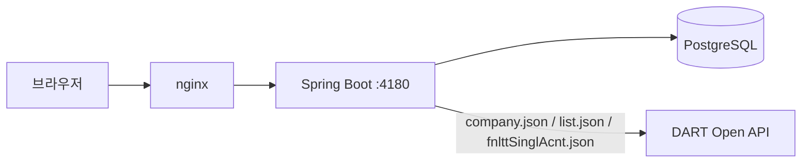

# MKDP — DART 공시 조회 서비스

**Live demo: https://mkdp.qwer4.org**

DART(금융감독원 전자공시시스템) 오픈API를 이용해 상장·비상장 기업의 공시목록과
재무 주요계정을 조회하는 웹 서비스. 로그인 없는 공개 데모다.

## 왜 다시 만들었나

이 프로젝트는 2022~2024년, 다른 개발자와 함께 만들다 중단된 사이드 프로젝트다
(`legacy/mkdp-v1.0.0/`). 원래 설계 문서는 Jira/Confluence로 관리했지만 2년이
지난 지금 접근이 끊겼다. v2는 남은 코드에서 v1이 무엇을 만들려 했는지, 그리고
왜 멈췄는지를 역추적해서 재구축한 결과다. 구체적인 내용은
[`docs/V1-RETROSPECTIVE.md`](docs/V1-RETROSPECTIVE.md)에 정리했다.

핵심 요약: v1은 DART 공시 데이터로 포트폴리오 백테스트(수익률/MDD 계산)까지
만들려 했지만, **DART는 일별 주가를 제공하지 않는다** — 가격 데이터 소스가 없어
백테스트 자체가 원천적으로 불가능한 설계였다. 그 외에도 스트림 처리 버그,
인증 미강제, 시크릿 하드코딩 등 여러 문제가 있었다. v2는 DART가 실제로 제공하는
영역(공시·재무)으로 범위를 좁혀 **끝까지 동작하는 서비스**를 만드는 데 집중했다.

## 기능

- 기업 검색 (기업명/종목코드)
- 기업개황 조회
- 공시목록 조회 (DART 원문 링크 포함)
- 재무 주요계정 3개년 추이 (매출액 / 영업이익 / 당기순이익)

## 아키텍처

자세한 내용은 [`docs/ARCHITECTURE.md`](docs/ARCHITECTURE.md) 참고.



## 스택

| 영역 | 기술 |
|------|------|
| Backend | Kotlin 2.0, Spring Boot 3.3, JDBC(NamedParameterJdbcTemplate), Flyway, Caffeine 캐시 |
| Frontend | Vue 3, Vite, TypeScript, Tailwind CSS v4, Pinia |
| DB | PostgreSQL 16 (운영), H2 (로컬/테스트) |
| 배포 | 단일 jar + systemd + nginx (Docker 미사용) |

## 로컬 실행

### Backend

```bash
cd backend
./gradlew test bootJar
DART_API_KEY=<opendart.fss.or.kr에서 발급받은 키> java -jar build/libs/mkdp-*-SNAPSHOT.jar
```

`DART_API_KEY` 없이도 기동은 되지만 검색을 제외한 모든 API가 DART 인증 오류로
실패한다. H2 파일 DB(`./data/mkdp`)를 기본으로 사용한다.

### Frontend

```bash
cd frontend
npm install
npm run dev   # http://localhost:5173, /api는 backend :4180으로 프록시
```

프로덕션 빌드(`npm run build`)는 `backend/src/main/resources/static/`으로
출력되어 jar 하나에 번들된다.

### 최초 기업 데이터 동기화

검색이 동작하려면 DART `corpCode.xml`(약 10만 건)을 먼저 동기화해야 한다.

```bash
curl -X POST -H "X-Sync-Token: <SYNC_TOKEN>" http://localhost:4180/api/admin/corp-codes/sync
```

## 라이선스 / 데이터 출처

데이터는 금융감독원 전자공시시스템(DART) 오픈API를 사용한다.
