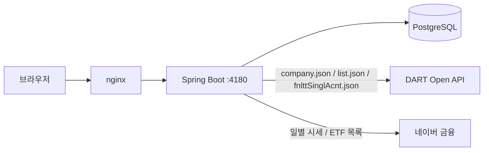

# MKDP — 공시 조회 + 포트폴리오 백테스트 서비스

[](https://github.com/wnstjqaodls/side-market-data-platform/actions/workflows/ci.yml)
[](https://kotlinlang.org)
[](https://spring.io/projects/spring-boot)
[](https://vuejs.org)
[](https://www.postgresql.org)
[](LICENSE)

**Live demo: https://mkdp.qwer4.org**

DART(금융감독원 전자공시시스템) 오픈API로 기업 공시·재무를 조회하고, 주식과
ETF를 담아 과거 데이터로 포트폴리오 백테스트를 돌려볼 수 있는 서비스.
로그인 없는 공개 데모다.

## 왜 다시 만들었나

이 프로젝트는 2022~2024년, 다른 개발자와 함께 만들다 중단된 사이드 프로젝트다
(`legacy/mkdp-v1.0.0/`). 원래 만들려던 건 portfolio-visualizer.com 스타일의
포트폴리오 백테스트 서비스였지만, **DART는 일별 주가를 제공하지 않아** 핵심
계산 자체가 불가능한 설계였다 — 이게 v1이 멈춘 진짜 이유다. 원래 설계 문서는
Jira/Confluence에 있었으나 2년 지난 지금 접근이 끊겨, 남은 코드에서 의도를
역추적해 재구축했다. 구체적인 내용은
[`docs/V1-RETROSPECTIVE.md`](docs/V1-RETROSPECTIVE.md)에 정리했다.

- **v2**: 백테스트를 걷어내고 DART가 실제로 제공하는 영역(공시·재무 조회)만으로
  끝까지 동작하는 서비스를 먼저 완성했다.
- **v3**: 네이버 금융 비공식 엔드포인트로 일별 시세와 ETF 유니버스를 확보해,
  v1이 완성하지 못했던 포트폴리오 백테스트를 실제로 되살렸다.

## 기능

- 기업 검색 (기업명/종목코드), 기업개황, 공시목록(DART 원문 링크 포함)
- 재무 주요계정 3개년 추이 (매출액 / 영업이익 / 당기순이익)
- 주식·ETF 통합 검색
- 포트폴리오 장바구니 — 여러 종목을 담고 비중을 조절
- 포트폴리오 백테스트 — 매수 후 보유(buy & hold) 가정, 총수익률/CAGR/최대낙폭(MDD)
  계산과 자산가치 추이 차트

## 아키텍처

자세한 내용은 [`docs/ARCHITECTURE.md`](docs/ARCHITECTURE.md) 참고.



## 스택

| 영역 | 기술 |
|------|------|
| Backend | Kotlin 2.0, Spring Boot 3.3, JDBC(NamedParameterJdbcTemplate), Flyway, Caffeine 캐시 |
| Frontend | Vue 3, Vite, TypeScript, Tailwind CSS v4, Pinia |
| DB | PostgreSQL 16 (운영), H2 (로컬/테스트) |
| 배포 | 단일 jar + systemd + nginx (Docker 미사용) |

## 로컬 실행

### Backend

```bash
cd backend
./gradlew test bootJar
DART_API_KEY=<opendart.fss.or.kr에서 발급받은 키> java -jar build/libs/mkdp-*-SNAPSHOT.jar
```

`DART_API_KEY` 없이도 기동은 되지만 검색을 제외한 모든 API가 DART 인증 오류로
실패한다. H2 파일 DB(`./data/mkdp`)를 기본으로 사용한다.

### Frontend

```bash
cd frontend
npm install
npm run dev   # http://localhost:5173, /api는 backend :4180으로 프록시
```

프로덕션 빌드(`npm run build`)는 `backend/src/main/resources/static/`으로
출력되어 jar 하나에 번들된다.

### 최초 데이터 동기화

기업 검색과 ETF 검색이 동작하려면 각각 동기화가 필요하다.

```bash
# DART corpCode.xml (약 10만 건)
curl -X POST -H "X-Sync-Token: <SYNC_TOKEN>" http://localhost:4180/api/admin/corp-codes/sync

# 네이버 금융 ETF 목록 (약 1,160건)
curl -X POST -H "X-Sync-Token: <SYNC_TOKEN>" http://localhost:4180/api/admin/etfs/sync
```

일별 시세는 동기화 없이 백테스트 요청 시점에 온디맨드로 캐시된다(첫 조회만 느리고
이후는 DB 캐시를 사용).

## 기여

브랜치·커밋·PR 규칙과 코드 규칙은 [`CONTRIBUTING.md`](CONTRIBUTING.md)에 정리했다.
버그와 개선 제안은 [Issues](https://github.com/wnstjqaodls/side-market-data-platform/issues)로 받는다.

## 라이선스 / 데이터 출처

코드는 [MIT 라이선스](LICENSE)를 따른다.

데이터는 DART(금융감독원 전자공시시스템) 오픈API와 네이버 금융 비공식 엔드포인트(일별
시세, ETF 목록)에서 가져온다. 네이버 금융은 공개된 공식 API가 아니므로 응답 형식이
예고 없이 바뀔 수 있다 — 이 서비스는 학습·데모 목적이며 투자 판단의 근거로 쓸 수 없다.
