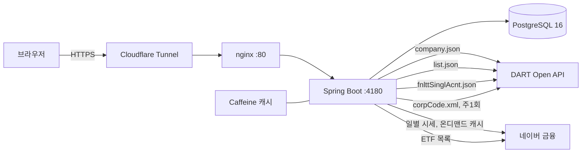
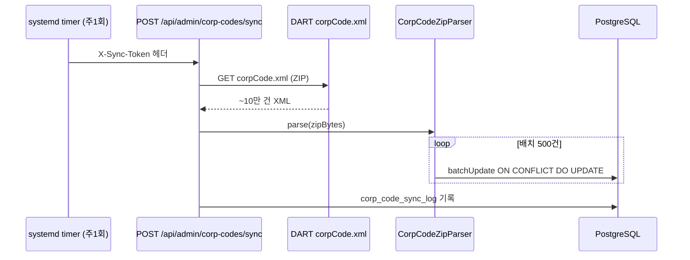

# Architecture

## 개요



프론트엔드는 별도 서버 없이 `backend/src/main/resources/static/`에 빌드되어
Spring Boot jar 하나에 번들된다. nginx는 TLS 종료 이후의 단순 리버스 프록시
역할만 한다.

## Backend 패키지 구조

```text
com.mkdp
├─ api/            REST 컨트롤러 (CompanyController, AssetController, BacktestController,
│                  AdminSyncController), 예외 핸들러
├─ config/         DartProperties, NaverFinanceProperties, MkdpProperties, RestClientConfig,
│                  CacheConfig, SpaWebConfig(SPA 폴백)
├─ dart/           DartClient(DART 호출 유일 지점), CorpCodeZipParser, 예외, DTO
├─ price/          NaverPriceClient(일별 시세), NaverEtfListClient(ETF 유니버스)
├─ domain/         CompanyService, DisclosureService, FinancialService, CorpCodeSyncService,
│                  EtfSyncService, PriceSyncService, AssetSearchService, BacktestService
└─ db/             CompanyRepository, EtfRepository, PriceHistoryRepository, SyncLogRepository류
                  (JdbcTemplate, ORM 없음)
```

**ETF는 DART 기업 마스터에 없다.** ETF는 신탁 구조라 DART 공시 대상 법인이
아니어서 `corpCode.xml`에 포함되지 않는다. 그래서 `etf` 테이블은 별도로
네이버 금융 ETF 목록에서 동기화한다 — `AssetSearchService`가 `company`와 `etf`
두 테이블을 합쳐 통합 검색 결과를 만든다.

**가격은 온디맨드로 캐시한다.** 백테스트 요청이 들어올 때 해당 심볼·기간의
시세가 `price_history`에 이미 커버되는지 확인하고, 없으면 그때 네이버에서
가져와 채운다 — 매번 외부 호출을 하지 않기 위함이다(`PriceSyncService`).

### 핵심 설계 결정

**`DartClient`가 DART 호출의 유일한 지점이다.** v1은 4개 컨트롤러가 각자 DART를
호출하며 응답 `status` 필드를 확인하지 않았다. v2는 모든 호출을 한 곳으로 모으고,
`status` 코드를 항상 검사해 도메인 예외(`DartApiException`)로 변환한다.

| DART status | 의미 | 처리 |
|---|---|---|
| `000` | 정상 | 그대로 반환 |
| `013` | 데이터 없음 | 공시/재무 조회에서는 빈 결과로 취급 (기업 자체가 없을 때만 예외) |
| `020` | 요청 한도 초과 | `RateLimited` → HTTP 429 |
| `010`/`011`/`012` | 인증키 오류 | `InvalidKey` → HTTP 502 |

**`CorpCodeZipParser`는 StAX로 스트리밍 파싱한다.** DART `corpCode.xml`은 ZIP에
싸인 XML로 약 10만 건의 레코드를 담고 있다. 전체를 DOM으로 메모리에 올리지 않고,
`corp_code` 필드가 다시 등장하는 시점을 레코드 경계로 판단해 스트리밍으로 처리한다.
ZIP 엔트리 바이트를 먼저 `ByteArrayInputStream`으로 떼어낸 뒤 StAX 리더에 넘기는데,
이는 JDK 기본 StAX 구현이 EOF에서 하위 스트림을 닫아버려 공유 중인
`ZipInputStream`의 다음 `getNextEntry()` 호출이 깨지는 문제를 피하기 위함이다.

**캐시는 Caffeine으로 3종.** 기업개황/재무는 24시간, 공시목록은 10분 TTL —
DART 일 20,000건 한도 안에서 공개 데모가 안전하게 반복 조회되도록 하는 1차 방어선.

**DB는 순수 JDBC.** ORM 없이 `NamedParameterJdbcTemplate` + Flyway. `company`
테이블은 `corp_code`(8자리)를 PK로, 검색은 자체 DB에서만 수행하고 DART는 기업개황
/공시/재무 상세 조회 시점에만 호출한다 — 검색어 입력마다 DART를 때리지 않는다.

## Frontend

Vite + Vue 3 + TypeScript + Tailwind v4 + Pinia + vue-router. 화면 흐름은
검색(디바운스) → 결과 목록 → 상세(기업개황 카드 + 공시 테이블 + 재무 차트 탭).

재무 차트는 매출액/영업이익/당기순이익을 3개의 소형 배수(small-multiple) 바
차트로 그린다. 세 계정의 규모 차이가 커서 하나의 y축에 그리면 왜곡되므로
(dual-axis 대신) 계정별로 독립된 축을 쓴다. 손실은 색상이 아니라 회계 관행대로
괄호 표기로 구분한다.

## 데이터 흐름 — 기업 마스터 동기화



## 포트폴리오 백테스트

`BacktestService`는 매수 후 보유(buy & hold)를 가정한다 — 시작일에 목표 비중대로
1회 매수하고 리밸런싱 없이 그대로 보유. 계산 절차:

1. 담은 각 종목의 `startDate~endDate` 시세를 `PriceSyncService`로 확보(캐시 우선)
2. 모든 종목의 거래일 교집합을 공통 타임라인으로 사용(주식/ETF마다 상장일·휴장일이
   다를 수 있으므로)
3. 첫 공통 거래일 가격으로 종목별 매수 수량 계산 (`초기금액 × 비중 / 시작가`)
4. 각 거래일의 포트폴리오 가치 = Σ(수량 × 그날 종가)
5. 총수익률, CAGR(연복리 환산), MDD(최대 낙폭 — 고점 대비 최대 하락폭)를 산출

비중은 합이 100이 아니어도 된다 — 서버가 합계로 정규화한다. 리밸런싱 옵션,
샤프 지수, 벤치마크 비교는 이후 과제로 남겼다.

## 배포

Docker 없이 plain jar + systemd + nginx. 배포 오케스트레이션(LXC 프로비저닝,
CI, 운영 배선)은 이 리포가 아니라 인프라 저장소(homeLab-build)에서 관리한다 —
이 리포는 애플리케이션 코드와 `deploy/install-runtime.sh` / `deploy/verify-runtime.sh`
(설치·검증 스크립트 자체)만 갖는다.
